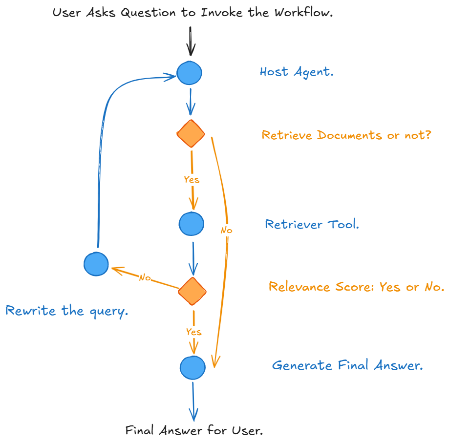

# Demo - RAG Agent

A Retrieval-Augmented Generation (RAG) system built with LangChain and LangGraph for demo. 

This project demonstrates an intelligent agentic workflow that can process multiple documents, answer questions, measure retrieval quality, use LangFuse to trace message exchanges and costs, and keep a logging system for future reference at thread level.

With use case, it consumes job description and applicant documents and can help decide whether the applicant is a good fit for the position, which can be transferred to many use case such as if the claim is eligible for some policies.



## Features

### Core Functionality
- **Multi-Document RAG**: Process and query multiple PDF documents simultaneously.
- **Streaming Responses**: Generate response real-time with progress tracking.
- **Memory and Thread Management**: Manage the message exchanges with memory at thread level.
- **LangFuse Tracing**: Use LangFuse to trace the detailed message exchanges, tool calling, and costs.

### Advanced Capabilities
- **Agentic Decision Making**: The system decides when to retrieve information vs. provide direct answers.
- **Document Relevance Grading**: Evaluates the relevance of retrieved document with AI power.
- **Intelligent Query Processing**: Automatically rewrites queries when retrieved documents are irrelevant.
- **Conversation Logging**: Take and keep comprehensive logging of key interactions and metrics of each thread for all audiences.
- **Performance Metrics**: Calculate and tracks Retrieval accuracy.

## Project Structure

```
suncorp-interview-prep/
├── chroma_db/                                  # Vector database storage
├── chroma_db_test/                             # Vector database storage for base version
├── logs/                                       # Conversation and performance logs
├── pdfs/                                       # Source documents
│   ├── 20250806_CV_Xiaoshi Lu (Alexandra).pdf  
│   └── suncorp_job_description.pdf
├── langgraph-agentic-rag-base.ipynb            # The base agentic rag pipeline with LangGraph.
├── langgraph-agentic-rag.ipynb                 # The polished and upgraded rag pipeline to showcase.
├── requirements.txt                            # Python dependencies
├── README.md                                   # This file
├── workflow.png                                # The workflow chart
```

## Installation

### Prerequisites
- Python 3.13+
- OpenAI API key

### Setup Instructions

1. **Clone the repository**
   ```bash
   git clone <repository-url>
   cd suncorp-interview-prep
   ```

2. **Install dependencies**
   ```bash
   pip install -r requirements.txt
   ```

3. **Set up environment variables**
   Update `.env` file in the root directory:
   ```env
   OPENAI_API_KEY=your_openai_api_key
   LANGFUSE_PUBLIC_KEY=your_langfuse_public_key
   LANGFUSE_SECRET_KEY=your_langfuse_secret_key
   ```

4. **Prepare documents**
   Place your PDF documents in the `pdfs/` directory.

## Usage

### Base Document RAG (`langgraph-agentic-rag-base.ipynb`)
This implementation focuses on querying a single document with intelligent retrieval and response generation.

**Key Features:**
- Processes individual PDF documents within a single session.
- Assess retrieval relevance and rewrite query if needed.
- Generate response.

### Upgraded Document RAG (`langgraph-agentic-rag.ipynb`)
This enhanced version can handle multiple documents simultaneously. It integrates version control in Vector Store, formats the outputs of workflow so they are more human-friendly, introduces memory and thread for persistent chat and message management, uses LangFuse for real-time monitoring and tracing, sets up the logging system to capture key information and retrieval quality for each thread.

**Key Features:**
- Multi-document processing.
- Cross-document information synthesis.
- Version control in Vector Store.
- Clear and human-friendly workflow outputs.
- Consistent chat history with memories.
- LangFuse tracing for detailed message exchanges, tool calling, and costs.
- Local logging system with key message exchanges and metrics for all audiences.
- Retrieval quality measurement.

### Running the System

1. **Open the desired notebook** in IDE.
2. **Execute all cells** to set up the environment.
3. **Run the test cases** to see the system in action and adjust based on your interets and needs.

Example usage:
```python
# Initialize the system
config = {"configurable": {"thread_id": "interview", "questions": [], "callbacks": [langfuse_handler]}}
logs = []

# Ask questions
deal_with_single_question(logs, graph, "What are Xiaoshi Lu's technical skills?", config)
deal_with_single_question(logs, graph, "Is she eligible for the Suncorp position?", config)

# Run the cells to the end. 
# Logs are stored in logs/interview_20250829_212643.csv
```

## Technical Architecture

### Core Components

1. **Document Processing**
   - PDF loading and chunking
   - Text splitting with overlap
   - Metadata management
   
2. **Retriever tool with Vector Store (ChromaDB)**
   - Document embedding and storage
   - Semantic search capabilities
   - Persistent storage with version control

3. **LangGraph Workflow**
   - State, memory, and thread management
   - Conditional routing
   - Tool integration
   - Human-friendly outputs
   - LangFuse tracing
   - Local logging system

4. **Intelligent Agent**
   - Decision making for retrieval vs. direct response
   - Tool calling capabilities
   - Context-aware responses

### Workflow Steps

1. **Query Input**: User asks a question.
2. **Agent Decision**: System decides whether to retrieve documents.
3. **Document Retrieval**: If needed, searches vector database.
4. **Relevance Assessment**: AI evaluates if retrieved documents are relevant.
5. **Query Transformation**: If irrelevant, rewrites the query and tries another retrieval.
6. **Response Generation**: Generates final answer based on the context and outputs readible information.
7. **LangFuse Tracing**: Trace detailed message exchanges, tool calling and costs.
9. **Logging**: Records key interactions and calculates metrics for all audiences.

## Performance Metrics

The system tracks several key metrics:
- **Retrieval Count**: Number of document retrievals per user question.
- **Rewrite Count**: Number of query rewrites needed  per user question.
- **Relevance Percentage**: Accuracy of document retrieval, which means the one-time shooting retrieval vs. total retrieval per thread.

## Future Development

Upcoming features include:
- **RAGAS Integration**: Enhanced retriever quality evaluation with testing dataset.
- **Advanced Analytics**: More sophisticated performance metrics to evalute resonse quality.
- **UI Improvements**: Better visualization of results with Gradio.

## Contributing

1. Fork the repository.
2. Create a feature branch.
3. Make your changes.
4. Add tests if applicable.
5. Submit a pull request.

## License

This project is for educational and interview preparation purposes.

## Troubleshooting

### Common Issues

1. **OpenAI API Key Not Set**
   - Ensure your `.env` file contains the correct API key.
   - Check that the key has sufficient credits.

2. **LangFuse Tracing Pending**
   - Ensure your `.env` file contains the correct API key.
   - Check host name in US or in EU.

3. **ChromaDB Issues**
   - Clear the `chroma_db/` directory if experiencing corruption.
   - Ensure write permissions in the project directory.

4. **PDF Loading Errors**
   - Verify PDF files are not corrupted.
   - Check file paths in the notebook.

### Getting Help

If you encounter issues:
1. Check the logs in the `logs/` directory.
2. Review the error messages in the notebook output.
3. Check the tracing records in LangFuse.
3. Verify all dependencies are installed correctly.

---

**Note**: This system is designed for interview preparation and demonstrates advanced RAG capabilities. 
